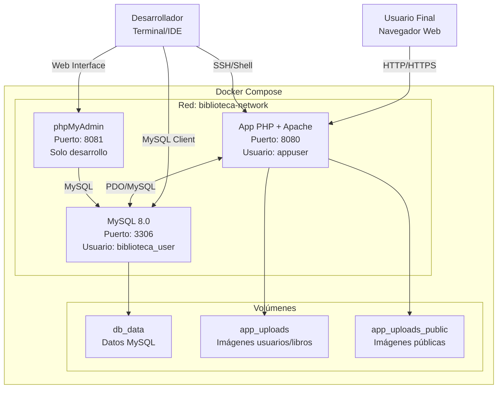
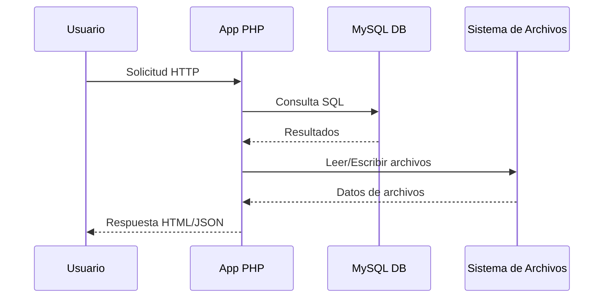
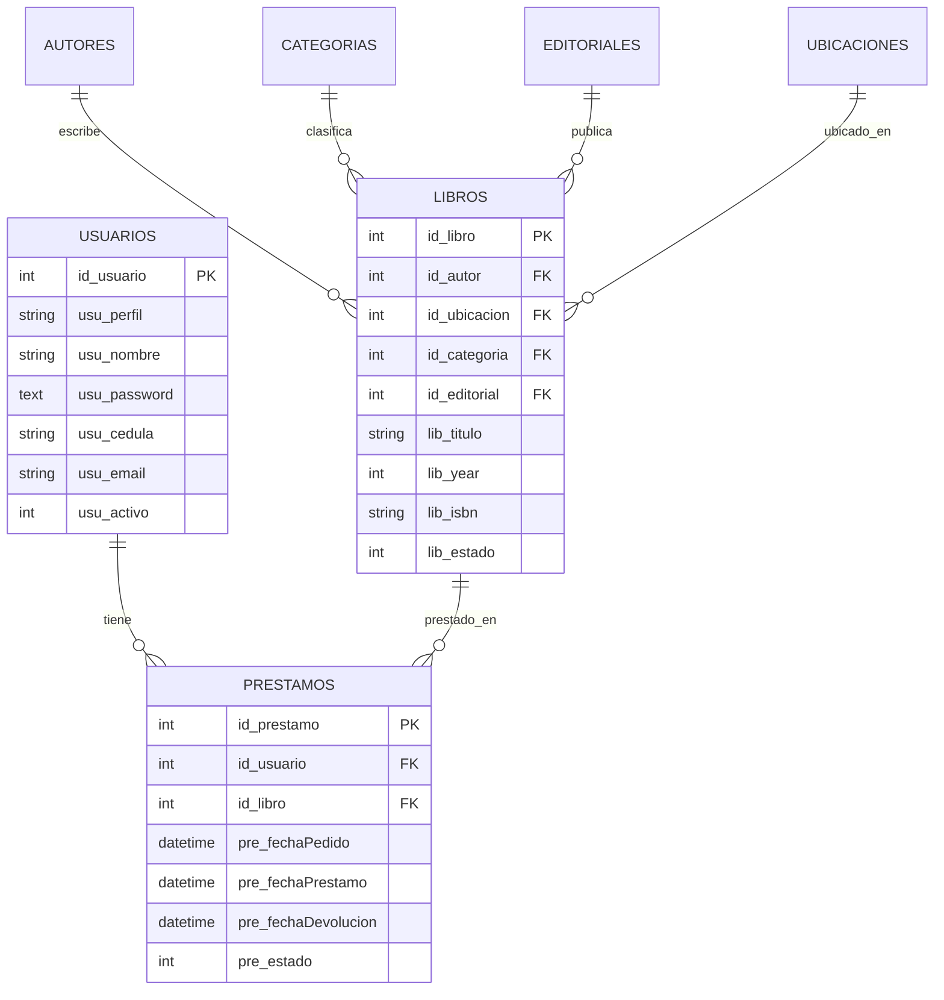
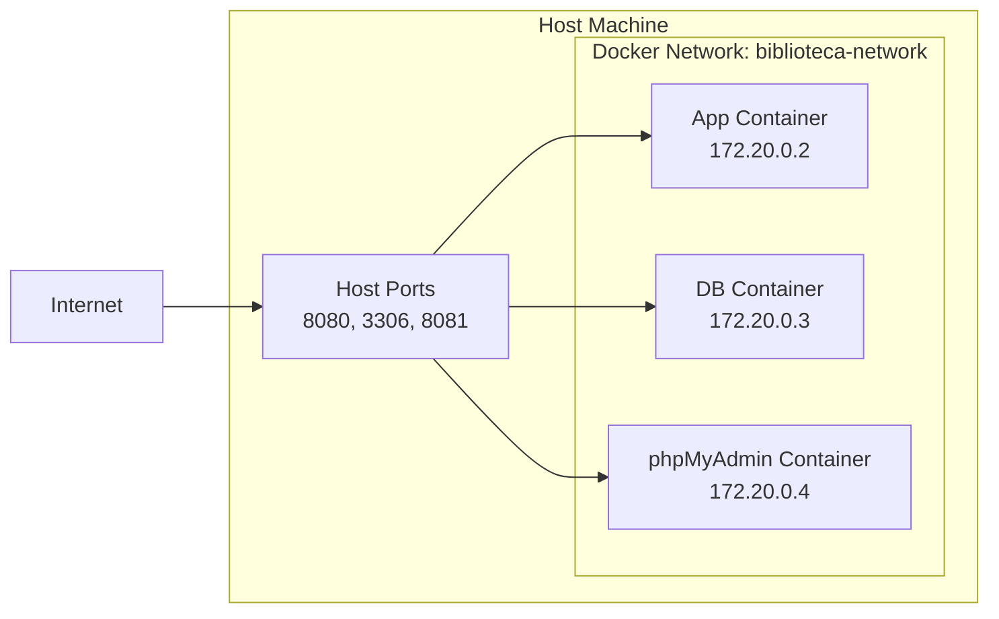
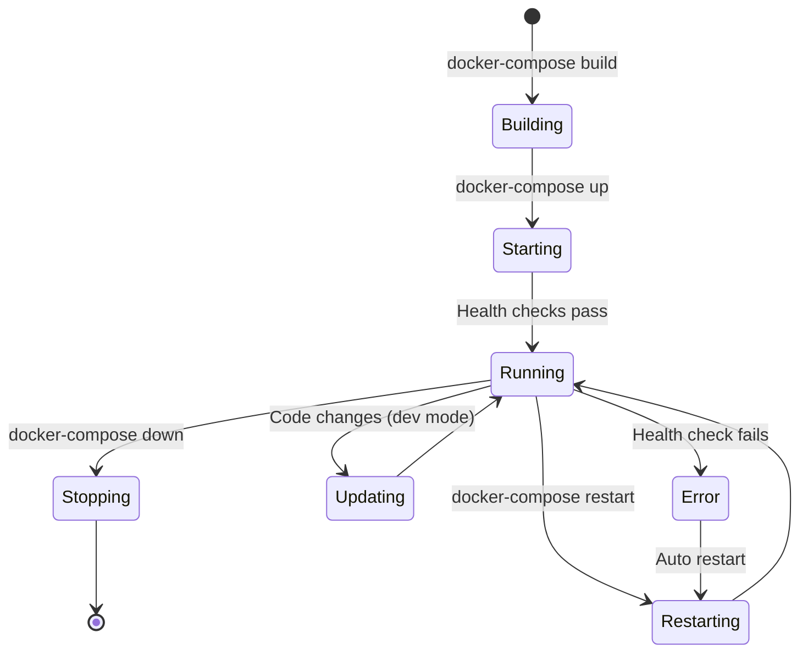
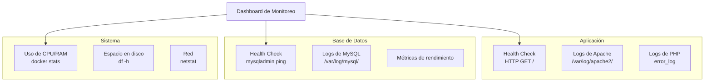
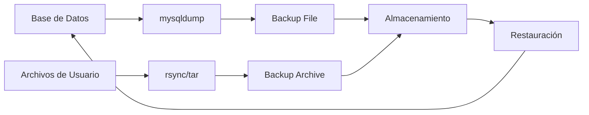

# 🏗️ Arquitectura del Sistema

## Diagrama de Servicios



## Flujo de Datos



## Estructura de Base de Datos



## Configuración de Redes



## Ciclo de Vida de Contenedores



## Estrategia de Despliegue

### Desarrollo
- Bind mounts para hot reload
- phpMyAdmin habilitado
- Logs detallados
- Debug mode activado

### Producción
- Imágenes optimizadas
- Usuario no-root
- Health checks
- Límites de recursos
- Logs estructurados

## Monitoreo y Observabilidad



## Seguridad

### Capas de Seguridad Implementadas

1. **Contenedor**
   - Usuario no-root
   - Imagen mínima
   - Health checks

2. **Aplicación**
   - Variables de entorno
   - Validación PDO
   - Headers de seguridad

3. **Base de Datos**
   - Usuario dedicado
   - Contraseñas seguras
   - Logs de auditoría

4. **Red**
   - Red aislada
   - Puertos específicos
   - Sin exposición innecesaria

## Escalabilidad

### Horizontal
- Múltiples instancias de app
- Load balancer (nginx/traefik)
- Base de datos replicada

### Vertical
- Aumentar recursos de contenedores
- Optimizar consultas SQL
- Cache de aplicación (Redis)

## Backup y Recuperación



## Troubleshooting

### Flujo de Diagnóstico

1. **Verificar estado de servicios**
   ```bash
   make status
   docker-compose ps
   ```

2. **Revisar logs**
   ```bash
   make logs-app
   make logs-db
   ```

3. **Verificar conectividad**
   ```bash
   make shell-db
   make smoke
   ```

4. **Reiniciar servicios**
   ```bash
   make restart
   ```

5. **Limpieza completa**
   ```bash
   make clean-all
   make setup
   make dev
   ```
